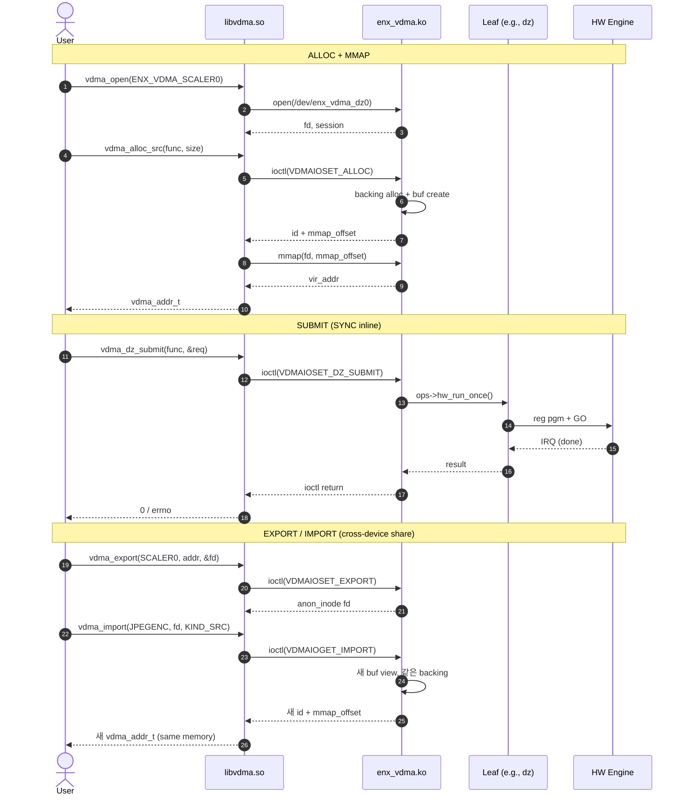
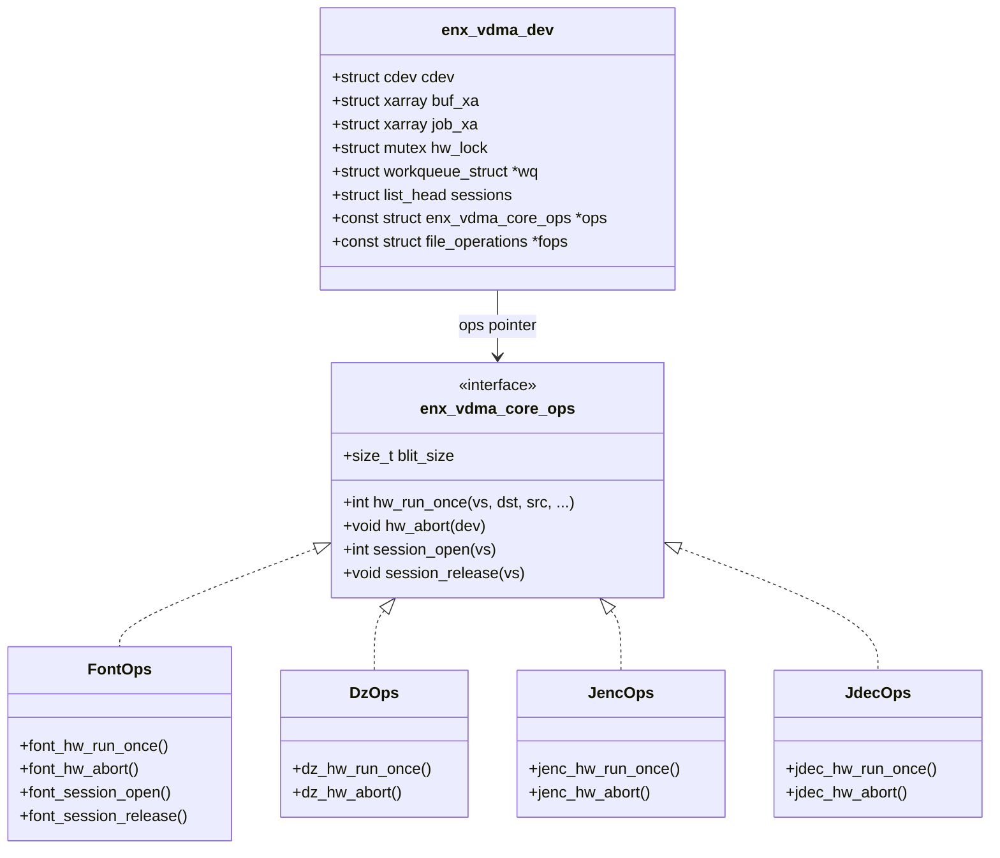
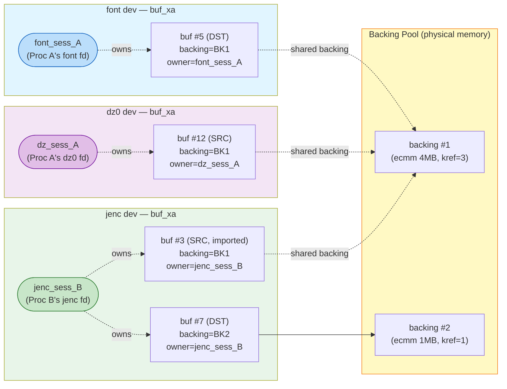
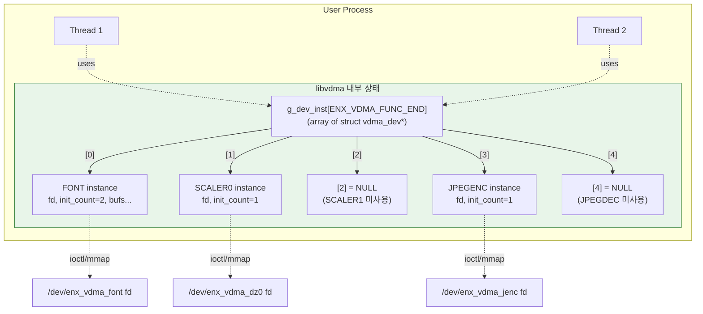
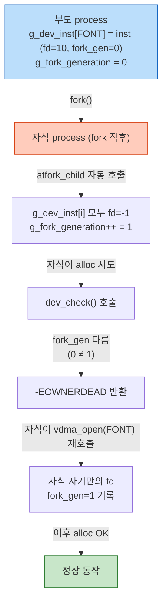
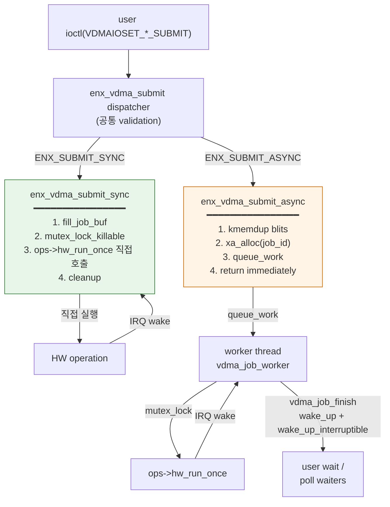

# EN683 VDMA — Architecture Diagram

전체 아키텍처를 Mermaid 다이어그램으로 시각화. VSCode markdown preview, GitHub,
또는 https://mermaid.live 에서 렌더링됨.

---

## 1. 전체 아키텍처 (Core / Leaves / User)

`architecture.dot` 과 동일한 layout — 3 horizontal stripes (User → Kernel → HW),
Kernel 내부는 좌 **CORE** · 우 **Leaf Modules** 로 분할.

```mermaid
graph TB
    %% ============================================================
    %% Top stripe : User Space
    %% ============================================================
    subgraph UserSpace["User Space"]
        direction TB
        subgraph Apps[" "]
            direction LR
            APP1[font app]
            APP2[scaler app]
            APP3[jpegenc app]
            APP4[jpegdec app]
            APP5[unified app]
        end
        LIB["<b>libvdma.so / libvdma.a</b><br/><i>unified, device-indexed singleton</i><br/>g_dev_inst[ENX_VDMA_FUNC_END]<br/>open · close · alloc · free<br/>*_submit · export · import"]
        APP1 --> LIB
        APP2 --> LIB
        APP3 --> LIB
        APP4 --> LIB
        APP5 --> LIB
    end

    %% ============================================================
    %% Middle stripe : Kernel Space (CORE left, Leaves right)
    %% ============================================================
    subgraph KernelSpace["Kernel Space"]
        direction LR

        subgraph Core["enx_vdma.ko — CORE"]
            direction LR
            subgraph CoreInner[" "]
                direction TB
                COMMON["<b>Common ioctls</b><br/>ALLOC · FREE · MMAP<br/>EXPORT · IMPORT<br/>WAIT · ABORT"]
                MEM["<b>Memory model</b><br/>backing + buf (kref'd)<br/>cross-device share"]
                SUBMIT["<b>SUBMIT dispatcher</b><br/>SYNC inline<br/>ASYNC workqueue"]
                DBG["<b>debugfs</b><br/>stats · bufs<br/>jobs · sessions"]
            end
            OPS["<b>EXPORT_SYMBOL_GPL<br/>boundary</b><br/>enx_vdma_submit<br/>enx_vdma_abort<br/>enx_vdma_open/release<br/>enx_vdma_mmap/poll<br/>ioctl helpers<br/>core_register"]
        end

        subgraph Leaves["Leaf Modules"]
            direction LR
            FONT["<b>enx_vdma-font.ko</b><br/>/dev/enx_vdma_font"]
            DZ0["<b>enx_vdma-dz.ko ch0</b><br/>/dev/enx_vdma_dz0"]
            DZ1["<b>enx_vdma-dz.ko ch1</b><br/>/dev/enx_vdma_dz1"]
            JENC["<b>enx_vdma-jenc.ko</b><br/>/dev/enx_vdma_jenc"]
            JDEC["<b>enx_vdma-jdec.ko</b><br/>/dev/enx_vdma_jdec"]
        end
    end

    %% ============================================================
    %% Bottom stripe : HW
    %% ============================================================
    subgraph HW["HW (EN683 SoC)"]
        direction LR
        HW_F[(FONT engine)]
        HW_DZ0[(DZ ch0)]
        HW_DZ1[(DZ ch1)]
        HW_JE[(JPEG enc)]
        HW_JD[(JPEG dec)]
    end

    %% ─── Cross-stripe edges ───
    %% lib → leaves (가시, 굵게)
    LIB ==>|"ioctl / mmap<br/>via /dev"| Leaves

    %% leaves → core (EXPORT_SYMBOL_GPL boundary, dashed)
    Leaves -.->|"core_register<br/>core_ops"| OPS

    %% leaves → HW (1:1 column-aligned)
    FONT --> HW_F
    DZ0  --> HW_DZ0
    DZ1  --> HW_DZ1
    JENC --> HW_JE
    JDEC --> HW_JD

    %% ─── Styles (architecture.dot 와 동일 팔레트) ───
    style UserSpace fill:#e8f5e9,stroke:#2e7d32,stroke-width:2px
    style KernelSpace fill:#f5f5f5,stroke:#666666,stroke-width:2px
    style Core fill:#e1f5ff,stroke:#0066cc,stroke-width:2px
    style Leaves fill:#fff4e6,stroke:#cc6600,stroke-width:2px
    style HW fill:#fafafa,stroke:#999999,stroke-width:2px
    style LIB fill:#c8e6c9,stroke:#2e7d32
    style OPS fill:#fff9c4,stroke:#f57f17,stroke-width:2px
    style Apps fill:#e8f5e9,stroke:none
    style CoreInner fill:#e1f5ff,stroke:none

    linkStyle default stroke:#666666
```



> **Mermaid 의 한계** : Mermaid 의 auto-layout (dagre/elkjs) 는 dot 와 달리 cluster
> 좌/우 위치를 strict 하게 지정할 수 없습니다. Kernel Space 내부 `direction LR` 로
> CORE 좌측 / Leaf Modules 우측 배치를 hint 하지만, 정확한 픽셀 정렬이 필요하면
> `architecture.png` / `.svg` 를 사용하세요.

---

## 2. 데이터 흐름 (ALLOC + SUBMIT + EXPORT/IMPORT)



---

## 3. Core 의 `ops` 인터페이스 (Driver 가 구현)



---

## 4. 메모리 모델 — Backing / Buf / View

> **Session 모델** : Session 은 `/dev/enx_vdma_*` 의 **fd 별로** 1개씩 생성됩니다
> (`open()` → `struct enx_vdma_session` 1개 → `file->private_data` 보관).
> 따라서 같은 process 라도 device 를 N 개 열면 session 도 N 개. 아래
> 예시에선 **Process A 가 font/dz0 두 개 fd 를, Process B 가 jenc fd 하나**
> 를 열었으므로 총 **3 session** 이 있습니다.



해석:
- **Session 은 fd-당-1개** — Process A 가 font/dz0 두 fd 를 열어서 `font_sess_A`,
  `dz_sess_A` 두 session 이 각각 다른 device 의 `sessions` 리스트에 등록됨.
- **buf ↔ session 1:N** — 한 session 이 그 device 안에서 여러 buf 를 보유 가능.
  (Process B 의 jenc session 은 SRC + DST 두 buf 소유)
- **buf ↔ backing 1:N (shared)** — backing 은 kref 로 보호되며 서로 다른 session
  (또는 다른 device) 의 buf 끼리 EXPORT/IMPORT 로 공유. BK1 은 3 session
  (font/dz/jenc) 에서 모두 view 를 들고 있는 cross-device share 사례.
- **`session.bufs` 리스트** — 각 session 은 자기가 만든 buf 만 track. session 닫힘
  (release) 시 해당 buf 들의 refcount drop → 마지막 ref 떨어지면 backing 도 free.
- 각 dev 의 `buf_xa` 는 독립된 id 공간 (그래서 #5, #12, #3, #7 각각 다른 dev 의 id).

---

## 5. UserApp Singleton 구조



---

## 6. fork() 안전성 메커니즘



---

## 7. SYNC vs ASYNC submit 경로



---

## 8. 파일 트리

```
skeleton/
├── enx-vdma-core.c          ◄ ROOT (core 구현)
├── enx-vdma.h               ◄ core internal header
├── Makefile                 ◄ DRV_MODULES 변수로 통합 빌드
│
├── include-uapi/            ◄ UAPI 헤더 (kernel + user 공통)
│   ├── enx-vdma-uapi.h
│   ├── en683-font-uapi.h
│   ├── en683-dz-uapi.h
│   ├── en683-jpegenc-uapi.h
│   └── en683-jpegdec-uapi.h
│
├── font-drv/                ◄ DRV: FONT
├── dz-drv/                  ◄ DRV: DZ (multi-channel)
├── jpegenc-drv/             ◄ DRV: JPEG ENC
├── jpegdec-drv/             ◄ DRV: JPEG DEC
│
└── userapp/
    ├── lib/                 ◄ 통합 userspace lib
    │   ├── libvdma.h
    │   ├── libvdma.c
    │   └── Makefile
    ├── font/                ◄ legacy per-device lib + example
    ├── scaler/
    ├── jpegenc/
    └── jpegdec/
```

---

## 렌더링 도구

### Mermaid (이 문서)
| 도구 | 사용법 |
|---|---|
| VSCode | `Markdown Preview Enhanced` 확장 또는 `Ctrl+Shift+V` |
| GitHub / GitLab | README/Wiki 에 그대로 push 시 자동 렌더 |
| mermaid.live | https://mermaid.live/ — 코드 붙여넣기 |
| mmdc CLI | `npm install -g @mermaid-js/mermaid-cli` 후 `mmdc -i ARCHITECTURE.md -o out.png` |

### Graphviz (.dot 파일)

같은 디렉토리에 `.dot` 파일 3 종 + 미리 렌더된 PNG/SVG 가 있음:

| 파일 | 내용 | 산출물 |
|---|---|---|
| `architecture.dot` | 전체 아키텍처 (Core/Driver/User/HW) | `architecture.png`, `.svg` |
| `architecture-flow.dot` | Backing/Buf 공유 모델 (cross-device) | `architecture-flow.png`, `.svg` |
| `architecture-submit.dot` | SUBMIT path (SYNC vs ASYNC) | `architecture-submit.png`, `.svg` |

재 렌더링:
```sh
cd ref_md/
dot -Tpng architecture.dot         -o architecture.png
dot -Tsvg architecture-flow.dot    -o architecture-flow.svg
dot -Tpdf architecture-submit.dot  -o architecture-submit.pdf
```

`graphviz` 패키지 필요 (`sudo apt install graphviz`).
