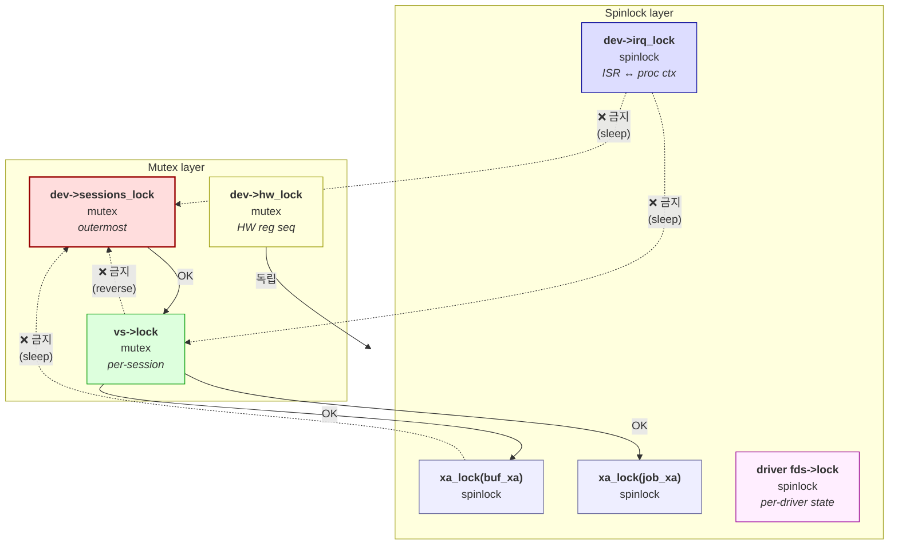

# enx_vdma — Function-agnostic Core

`enx_vdma.ko` 는 EN683 VDMA 패밀리 (`font`, `dz` (scaler), `jpegenc`, `jpegdec`)
가 공통으로 사용하는 lifecycle / buffer / job / cross-fd sharing / debug 인프라를
제공합니다. HW 레지스터 시퀀스는 driver 가 책임지고, core 는 **function-agnostic**
한 부분만 담당합니다.

---

## 1. 파일 구성

| 파일 | 영역 | 역할 |
|---|---|---|
| [include-uapi/enx-vdma-uapi.h](../include-uapi/enx-vdma-uapi.h) | UAPI (공용) | 공통 ioctl 번호, struct, kind/submit flag |
| [include-uapi/en683-font-uapi.h](../include-uapi/en683-font-uapi.h) | UAPI (font) | font submit args |
| [include-uapi/en683-dz-uapi.h](../include-uapi/en683-dz-uapi.h) | UAPI (scaler) | scaler submit args |
| [include-uapi/en683-jpeg-uapi.h](../include-uapi/en683-jpeg-uapi.h) | UAPI (jpeg) | jpegenc / jpegdec submit args |
| [enx-vdma.h](../enx-vdma.h) | kernel-internal | core 자료구조, `enx_vdma_core_ops`, EXPORT 함수 prototype |
| [enx-vdma-core.c](../enx-vdma-core.c) | kernel core | lifecycle / buffer / sharing / submit helper / debugfs |
| [vdma_error.h](../vdma_error.h) | kernel error code | `ENX_ERR_VDMA_*` (POSIX alias + lib 확장) |

---

## 2. Responsibility Boundary

| 책임 | 위치 |
|---|---|
| HW 레지스터 보호 | core (`dev->hw_lock` mutex) |
| ISR ↔ process 컨텍스트 동기화 | core (`dev->irq_lock` spinlock) |
| Buffer alloc/free, ref counting | core (`kref`, ecmm 백엔드) |
| Buffer ID 공간 | core (per-device `xa buf_xa`) |
| Cross-fd sharing | core (`anon_inode_getfd` + `vdma_buf_attach`) |
| Job submit / worker / async wait | core (workqueue + `xa job_xa`) |
| 비정상 종료 자원 회수 | core (`fops->release` drain) |
| **HW 레지스터 시퀀스** | **driver** (`core_ops->hw_run_once`) |
| **Function-specific UAPI** | **driver** (submit args, blit struct) |
| **Per-session private data** | **driver** (`session_open/release` callbacks) |

---

## 3. 핵심 자료구조

### 3.1 `struct enx_vdma_dev`
디바이스 단위 컨텍스트. driver 가 `enx_vdma_core_alloc()` → `enx_vdma_core_register()`
로 만들고 등록합니다.

```
enx_vdma_dev
├── chrdev / class / devid       ← /dev 노드 노출
├── regs (MMIO), irq, resource   ← driver 가 set
├── buf_xa, job_xa               ← per-device ID 공간
├── hw_lock (mutex)              ← HW 레지스터 직렬화
├── irq_lock (spinlock)          ← ISR ↔ process ctx 공유 상태
├── wq (ordered workqueue)       ← 1-job-at-a-time
├── hw_wq, hw_idle               ← worker ↔ ISR 동기화
├── max_bufs, max_src            ← per-driver 한계 (module_param)
├── buf_count (atomic)           ← 현재 활성 buf 수 (quota 검증)
├── dev_priv (driver-specific)   ← driver 의 per-device 상태
├── ops, fops, node_name         ← register 시 set
└── Debug / monitoring
    ├── dbg_dir (debugfs)
    ├── in_flight / bufs_active / sessions_open (atomic_t)
    ├── stats_submits / _failed / completed / bufs_alloc (atomic64_t)
    ├── bufs_bytes_inuse (atomic64_t)
    └── sessions list + sessions_lock (per-device session 등록)
```

### 3.2 `struct enx_vdma_sess`
한 fd 의 컨텍스트. core 의 `enx_vdma_open()` 이 alloc.

```
enx_vdma_sess
├── dev
├── lock (mutex)                 ← bufs/imports/jobs 보호
├── bufs / imports / jobs        ← per-session lists
├── poll_wq                      ← poll() / epoll 알림
├── pid                          ← debug 식별
├── sess_priv                    ← driver 가 자유로이 사용
└── dev_node                     ← dev->sessions 연결
```

### 3.3 `struct enx_vdma_buf` + `struct enx_vdma_backing`
물리 메모리 (`backing`) 와 그 메모리에 대한 session 별 뷰 (`buf`) 가 분리되어
있습니다. 동일 backing 을 여러 buf 가 가리킬 수 있어 cross-session 공유가
자연스럽게 동작합니다.

```
enx_vdma_backing                       enx_vdma_buf
├── cmm (eyenix_cmm_item)              ├── id, kind                     ← per-view ID + role
├── name (debug)                       ├── imported                     ← false: alloc'd / true: imported view
├── ref (kref)                         ├── backing (shared)             ← kref'd 공유 메모리
└── (alive while any buf refs it)      ├── dev, owner (sess)            ← orphan 시 owner=NULL
                                       ├── owner_node                   ← owner sess 의 bufs 리스트 노드
                                       └── ref (kref)                   ← buf-level lifecycle
```

- **kind** 는 view 마다 다를 수 있음 (alloc 측은 SRC, importer 가 DST 로 사용 등)
- **owner=NULL** : owner 가 FREE 했지만 importer 등이 ref 를 보유 중 (orphan)
- backing 의 kref 가 0 이 되면 ecmm 회수

### 3.4 `struct enx_vdma_job`
한 번의 HW 작업 단위. submit 마다 alloc, finish 후 reap 시 free.

```
enx_vdma_job
├── id, user_token, flags
├── submitter, result, done
├── blits, blit_size             ← driver-specific payload
├── work / node / wq             ← workqueue + per-job wait
├── dst (job_buf)
└── src[] (flex)                 ← src_count 개
```

---

## 4. Lock 계층 / 사용 규약

| Lock | 종류 | 보호 대상 | 외부 lock 과의 순서 |
|---|---|---|---|
| `dev->hw_lock` | mutex | HW reg 시퀀스 (`hw_run_once`) | 다른 lock 과 무관 |
| `dev->irq_lock` | spinlock | ISR ↔ process 공유 SW 상태 (driver 카운터 등) | ISR: `spin_lock()` / process: `spin_lock_irqsave()` |
| `dev->sessions_lock` | mutex | `dev->sessions` 리스트 | **outer**: sessions_lock → **inner**: vs->lock |
| `vs->lock` | mutex | per-session `bufs / imports / jobs` | inner |
| `dev->buf_xa` 내부 lock | spinlock | xa entry | xa_lock(&buf_xa) 로 명시 |
| `dev->job_xa` 내부 lock | spinlock | xa entry | xa_lock(&job_xa) 로 명시 |
| driver 의 `fds->lock` (font 예) | spinlock | driver 의 device-state | driver 책임 |

**중요 규약**:
- `sessions_lock` 안에서 `vs->lock` 잡는 건 OK, 반대는 금지
- `irq_lock` 잡고 mutex 잡지 말 것 (sleep)
- xa_lock 잡고 sleep 가능한 함수 호출 금지 (spinlock)
- mutex 두 개를 동시에 잡지 말 것 (필요 시 outer/inner 명시)

### 4.1 Lock-order graph (acquisition order)



핵심 규약 :

| Lock | Order | 의미 |
|------|-------|------|
| `sessions_lock` | outermost mutex | dev->sessions 리스트 walk (debugfs, release) |
| `vs->lock` | inner mutex | per-session buf/job 리스트 |
| `hw_lock` | 독립 mutex | HW reg programming (worker context, 다른 mutex 와 무관) |
| `xa_lock` | leaf spinlock | xa lookup atomic, 안에서 sleep 금지 |
| `irq_lock` | leaf spinlock | ISR/process 공유, mutex 못 잡음 |
| driver `*_lock` | leaf spinlock | driver 책임, 다른 lock 과 합치지 말 것 |

위반하면 가장 흔한 증상 :
- **AB-BA deadlock** : sessions_lock ← vs_lock 순서 바뀌면 발생
- **sleep in atomic** : xa_lock / irq_lock 안에서 kmalloc(GFP_KERNEL) 호출 시
- **scheduler complaint** : irq_lock 안에서 mutex 시도 시

---

## 5. Buffer Lifecycle

```
[ALLOC]  user ioctl → vdma_buffer_alloc
   ├── ecmm_alloc(size)
   ├── kref_init(ref) = 1
   ├── xa_alloc → id 할당
   ├── owner = vs, list_add(&vs->bufs)
   └── stats: bufs_active++, bytes_inuse += size

[mmap]   vdma_vm_open  → kref_get
         vdma_vm_close → kref_put

[EXPORT] anon_inode_getfd → kref_get
         close(fd)        → kref_put

[IMPORT] importer 의 attach_list 에 등록 → kref_get
         FREE 또는 fd close   → kref_put

[FREE]   user ioctl → vdma_buffer_free
         (owner ref drop) - 다른 ref 가 있으면 메모리 보존

[release / kref → 0]
  enx_vdma_buf_release
   ├── xa_erase(buf_xa)
   ├── ecmm_free(cmm)
   ├── bufs_active--, bytes_inuse -= size
   └── kfree(buf)
```

**보존 불변식**: ref > 0 이면 buf 메모리 alive. owner 가 free 해도 importer/HW 등이
들고 있으면 보존됨 (orphan: `owner = NULL`).

---

## 6. Job Lifecycle

```
[SUBMIT]  enx_vdma_submit(p)
   ├── 검증 (src_count, blit_size, max_src)
   ├── kzalloc(struct_size(job, src, count))
   ├── job->blits = ASYNC ? kmemdup : p->blits (caller-owned)
   ├── fill_vdma_submit_job_buf (dst + src 각각)
   │       └── ID kind 면 kref_get, RAW kind 면 paddr 검증
   ├── xa_alloc(job_xa) → id
   ├── list_add(&vs->jobs)
   ├── in_flight++
   ├── queue_work(dev->wq)
   │
   ├── if SYNC:  wait_event_killable
   │              ├── 성공 → ret = job->result
   │              └── 시그널 → flush_work + ret = -ERESTARTSYS
   │             xa_erase, list_del, kfree(job)
   │             (caller-owned blits 는 driver 가 free)
   │
   └── if ASYNC: p->job_id_out = job->id, return 0

[worker]  vdma_job_worker
   ├── mutex_lock(hw_lock)
   ├── ops->hw_run_once(vs, dst, src, count, blits, flags)
   ├── if (err) ops->hw_abort(dev)
   ├── mutex_unlock(hw_lock)
   └── vdma_job_finish
       ├── drop buf refs (kref_put 각각)
       ├── job->result = ret
       ├── job->done = true (smp_store_release)
       ├── in_flight--, completed++
       ├── wake_up_all(&job->wq)
       └── wake_up_interruptible(&vs->poll_wq)

[reap]    SYNC 호출자 / WAIT ioctl / release drain
   ├── xa_erase
   ├── list_del
   └── kfree(job), kfree(job->blits) if ASYNC
```

**핵심 invariants**:
- `kmemdup` 정책: **SYNC = caller-owned, ASYNC = kernel-owned** (`job->blits`)
- `flush_work` 는 worker 의 `hw_run_once` 가 완전히 끝났음을 보장 (signal 인터럽트 시 caller 가 blits 메모리 free 하기 전 보장이 필요)
- finish 가 buf refs 를 drop 하므로 HW DMA 중에 buf 메모리 영구화

---

## 7. Cross-fd Sharing (EXPORT / IMPORT)

`anon_inode_getfd` + SCM_RIGHTS 기반의 lightweight dma-buf-like 매커니즘.

```
Producer fd                         Consumer fd
─────────────                       ──────────────
ALLOC      → buf id X
EXPORT(X)  → export_fd  ──── SCM_RIGHTS ───→  IMPORT(fd) → id Y, mmap_offset
                          (UNIX socket)
buf->ref = owner(1) + export_fd(1) + attach(1) = 3
```

상세는 [enx-vdma-uapi.h](../enx-vdma-uapi.h) 의 EXPORT/IMPORT struct doc 참조.

---

## 8. core_ops — driver 와의 인터페이스

driver 는 `struct enx_vdma_core_ops` 를 등록합니다:

```c
struct enx_vdma_core_ops {
    int  (*hw_run_once)(struct enx_vdma_sess *vs,
                        struct enx_vdma_job_buf *dst,
                        struct enx_vdma_job_buf *src,
                        u32 src_count, void *blits, u32 flags);   /* 필수 */
    void (*hw_abort)(struct enx_vdma_dev *dev);                   /* 선택 */
    int  (*session_open)(struct enx_vdma_sess *vs);               /* 선택 */
    void (*session_release)(struct enx_vdma_sess *vs);            /* 선택 */
    size_t blit_size;
    const char *version;
};
```

- `hw_run_once` — worker context, `hw_lock` 보유 상태에서 호출. HW 동작 완료까지 sync 반환 (HW IRQ 까지 wait 포함).
- `hw_abort` — HW reset / abort. `enx_vdma_abort()` 호출 시 트리거.
- `session_open/release` — driver 가 per-session 자원 alloc/free. `vs->sess_priv` 사용.
- `blit_size` — submit struct (`enx_en683_*_submit_args`) 의 byte 크기. core 가 user→kernel copy 시 사용.
- `version` — debugfs 의 `stats` 에 노출되는 driver 버전 문자열.

---

## 9. debugfs 인터페이스

`/sys/kernel/debug/enx_vdma/<node_name>/` 아래에 다음 파일 자동 생성 (CONFIG_DEBUG_FS=y):

| 파일 | 내용 |
|---|---|
| `stats` | 누적 카운터 (submits / completed / failed / bufs_alloc / bytes_inuse 등) + 활성 카운터 (in_flight / bufs_active / sessions_open) |
| `bufs` | `buf_xa` 의 활성 항목 — id / kind / size / refs / owner_pid |
| `jobs` | `job_xa` 의 활성 항목 — id / pid / srcs / flags / done / result |
| `sessions` | `dev->sessions` 의 활성 항목 — pid / bufs / imports / jobs / bytes_owned |

driver 가 자기 파일 추가 시 `dev->dbg_dir` 를 root 로 사용. lifecycle 은 core 가 관리
(unregister 시 `debugfs_remove_recursive` 로 driver 파일까지 모두 정리).

### 사용 예
```sh
$ cat /sys/kernel/debug/enx_vdma/vdma_font/stats
in_flight:        2
bufs_active:      4
bufs_bytes_inuse: 12587008
sessions_open:    1
submits_total:    142
submits_failed:   0
completed:        140
bufs_total_alloc: 5

$ cat /sys/kernel/debug/enx_vdma/vdma_font/sessions
pid    bufs  imports  jobs  bytes_owned
8421   3     1        0     12582912
```

### Lock order (debugfs 컨텍스트)
- `bufs` / `jobs` walk: `xa_lock` 잡고 iteration
- `sessions` walk: **`sessions_lock` (outer) → `vs->lock` (inner)**

---

## 10. lifecycle helpers (driver 가 사용)

```c
/* driver 의 probe */
dev = enx_vdma_core_alloc(&pdev->dev);
dev->resource = ...;
dev->regs     = ...;
dev->max_bufs = N;
dev->max_src  = M;
request_irq(...);
enx_vdma_core_register(dev, &font_ops, &font_fops, "vdma_font");
/* 이 시점에 /dev/vdma_font + /sys/kernel/debug/enx_vdma/vdma_font/ 생성됨 */

/* driver 의 remove */
enx_vdma_core_unregister(dev);   /* drain workqueue + remove debugfs + cdev */
free_irq(...);
enx_vdma_core_free(dev);
```

---

## 11. UAPI Summary (`include-uapi/enx-vdma-uapi.h`)

### 공통 ioctl

| 번호 | name | 방향 | struct |
|---|---|---|---|
| 0x01 | `VDMAIOSET_ALLOC` | IN/OUT | `vdma_alloc_args` |
| 0x02 | `VDMAIOSET_FREE` | IN | `vdma_free_args` |
| 0x03 | `VDMAIOSET_WAIT` | IN/OUT | `vdma_wait_args` |
| 0x04 | `VDMAIOSET_EXPORT` | IN/OUT | `vdma_export_args` |
| 0x05 | `VDMAIOGET_IMPORT` | IN/OUT | `vdma_import_args` |
| 0x06 | `VDMAIOGET_ABORT` | OUT | `u32` |
| 0x07 | `VDMAIOGET_MAX_BUFS` | OUT | `u32` |
| 0x08 | `VDMAIOSET_MOD_INIT` | IN | `u32` (driver 가 사용) |

### Driver-specific submit (per-driver UAPI 헤더에 정의)

| ioctl | 정의 위치 | struct |
|---|---|---|
| `VDMAIOSET_FONT_SUBMIT` | en683-font-uapi.h | `enx_en683_font_submit_args` |
| `VDMAIOSET_DZ_SUBMIT` | en683-dz-uapi.h | `enx_en683_dz_submit_args` |
| `VDMAIOSET_JPEG_ENC_SUBMIT` | en683-jpeg-uapi.h | `enx_en683_jpegenc_submit_args` |
| `VDMAIOSET_JPEG_DEC_SUBMIT` | en683-jpeg-uapi.h | `enx_en683_jpegdec_submit_args` |
| `VDMAIOGET_MAX_SRCS` | en683-font-uapi.h | `u32` (font 만) |
| `VDMAIOSET_JPEG_DISCARD` | en683-jpeg-uapi.h | (no arg) |

**enum / flag**:
- `ENX_BUF_*` : kind (SRC / DST / RAW / ID / NONE)
- `ENX_SUBMIT_SYNC` (=0) / `ENX_SUBMIT_ASYNC` (=1)
- `enx_vdma_mode_type` : NONE / KERNEL / VIDEO_CORE
- `enx_vdma_format` : RGB/YUV variants (이름은 `VDMA_FMT_*` 로 lib 측 표기, kernel UAPI 측은 `eFmt_*` 가 표준)

---

## 12. EXPORT_SYMBOL_GPL 함수

driver 가 사용 가능한 core 의 공개 심볼:

```c
struct enx_vdma_dev *enx_vdma_core_alloc(struct device *parent);
int  enx_vdma_core_register(struct enx_vdma_dev *, const struct enx_vdma_core_ops *,
                            const struct file_operations *, const char *node_name);
void enx_vdma_core_unregister(struct enx_vdma_dev *);
void enx_vdma_core_free(struct enx_vdma_dev *);

/* fops 콜백 */
int      enx_vdma_open    (struct inode *, struct file *);
int      enx_vdma_release (struct inode *, struct file *);
int      enx_vdma_mmap    (struct file *, struct vm_area_struct *);
__poll_t enx_vdma_poll    (struct file *, struct poll_table_struct *);

/* ioctl helpers (driver 의 dispatcher 가 case 별로 호출) */
long enx_vdma_ioctl_alloc  (struct enx_vdma_sess *, void __user *);
long enx_vdma_ioctl_free   (struct enx_vdma_sess *, void __user *);
long enx_vdma_ioctl_wait   (struct enx_vdma_sess *, void __user *);
long enx_vdma_ioctl_export (struct enx_vdma_sess *, void __user *);
long enx_vdma_ioctl_import (struct enx_vdma_sess *, void __user *);
long enx_vdma_ioctl_maxbufs(struct enx_vdma_sess *, void __user *);
int  enx_vdma_submit       (struct enx_vdma_sess *, struct enx_vdma_submit_params *);
```

---

## 13. 알려진 제약

- **single-channel HW 가정** — workqueue 가 ordered 라서 device 당 한 번에 한 job
- **dma-buf 미호환** — anon_inode 기반의 자체 EXPORT/IMPORT. cross-driver 공유 필요 시 dma-buf adapter 추가 가능
- **IOMMU 미가정** — ecmm 의 phys_start 를 그대로 HW 에 박음
- **블리트 메타데이터 (blits) 의 lifetime**: SYNC 는 caller frame 유효 가정, ASYNC 는 kernel-owned
