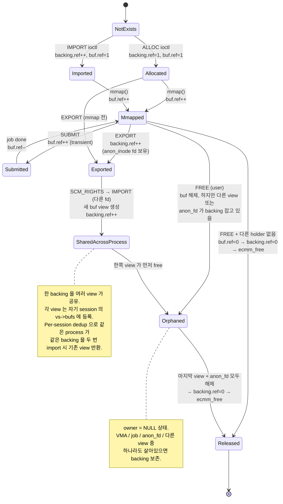

# 드라이버 자료구조 관계 노트

> [enx-vdma.h](../enx-vdma.h) 와 각 driver 헤더 (font-drv / dz-drv / jpegenc-drv /
> jpegdec-drv) 의 자료구조 관계 / 라이프사이클을 한 문서에 정리.
> 자료구조 정의는 core 헤더에 있고, 실제 사용 코드는
> [enx-vdma-core.c](../enx-vdma-core.c) (공통) 와 각 driver 의 `en683-*.c` 에 분산.
> 코드 리뷰 / 신규 기여자 온보딩 / 디버깅 시 reference.

본격적인 설명은 **[CORE.md](CORE.md)** 참고.
이 문서는 **다이어그램 + 관계 매트릭스** 위주.

---

## 1. 전체 그림 (core)

```
                ┌─────────────────────────────────────┐
                │   struct enx_vdma_dev               │   ← 디바이스 1개 (per /dev node)
                │   ────────────────────────────────  │
                │   buf_xa   (id ↔ buf*)              │   ── 모든 buf 가 여기 등록
                │   job_xa   (id ↔ job*)              │   ── 모든 job 이 여기 등록
                │   sessions (list)                   │   ── 모든 활성 session 등록
                │   hw_lock / irq_lock                │   ── 동기화 (§ 4)
                │   wq, hw_wq, hw_idle                │   ── worker ↔ ISR
                │   dbg_dir + 카운터 (in_flight 등)   │   ── debugfs 모니터링
                │   max_bufs, max_src, buf_count      │   ── per-device 한계 + 현재 사용량
                │   dev_priv (driver-specific)        │
                │   ops, fops, node_name              │
                └────────────┬────────────────────────┘
                             │
        ┌────────────────────┼─────────────────────────────────┐
        │ owns (XArray)      │ owns (list)                     │ owns
        │                    │                                 │ (per fd)
        ▼                    ▼                                 ▼
┌─────────────┐    ┌──────────────────────┐         ┌────────────────────┐
│enx_vdma_buf │    │  enx_vdma_sess (vs)  │   ←─── filp->private_data
│ ─────────── │    │  ─────────────────── │
│  id, kind   │    │  bufs    (소유+import│ ── 단일 리스트 (`imported` flag로 구분)
│  imported   │    │          모두)       │
│  backing ───┼────┐│  jobs    (이 sess의  │ ── list of in-flight jobs
│  dev        │    ││           job)      │
│  owner ─────┼────►│  poll_wq             │
│  owner_node │    │  pid                 │
│  ref (kref) │    │  sess_priv ──────────┼──► font_session 등 (driver 자유)
└──┬──────────┘    │  dev_node ───────────┼─────┐
   │   (n buf:1)   └──────────────────────┘     │
   │   shared                                    │
   │   backing                                   (dev->sessions 리스트 노드)
   ▼
┌────────────────────────────┐
│   enx_vdma_backing         │  ← 물리 메모리 1개 (kref'd, N views 공유)
│   ────────────────────────  │
│   cmm (ecmm_item)          │   ── 실제 물리/가상 주소
│   name (debug)             │
│   ref (kref)               │   ── alive while any buf refs it
└────────────────────────────┘

┌────────────────────────────┐
│   enx_vdma_job             │   ← 1번의 SUBMIT
│   ────────────────────────  │
│   id, user_token, flags    │
│   submitter (vs*)          │   ── 이 job 의 소유 sess
│   result, done             │
│   blits (kmemdup ASYNC 만) │
│   work (workqueue)         │
│   wq (per-job wait)        │
│   dst (job_buf)            │
│   src[] (flex)             │
└────────────────────────────┘
```

> **Cross-fd 공유 모델 변경 (v2)** : 별도 `enx_vdma_buf_attach` 구조체가 사라지고
> import 측이 자기 session 의 `bufs` 리스트에 **`imported=true` 인 buf view 를
> 등록**. 같은 `backing` 을 두 view 가 공유 (kref). 이전의 attach_list 패턴 대비
> 더 단순.

---

## 2. 관계 매트릭스 (core)

| From | To | 카디널리티 | 어떻게 도달 | 의미 |
|------|----|----------|-----------|-----|
| `dev` | `buf` | 1 : N | `dev->buf_xa` (XArray) | 디바이스 전역 buf 등록부 |
| `dev` | `job` | 1 : N | `dev->job_xa` (XArray) | 진행 중/완료 job 등록부 |
| `dev` | `sess` | 1 : N | `dev->sessions` 리스트 | 활성 session 등록부 (debugfs walk 용) |
| `sess` | `dev` | N : 1 | `sess->dev` (backref) | 어느 device 의 sess 인가 |
| `sess` | `buf` | 1 : N | `sess->bufs` 리스트 (`imported` 로 alloc/import 구분) | 이 sess 가 보유한 모든 view |
| `sess` | `job` | 1 : N | `sess->jobs` 리스트 | 이 sess 의 SUBMIT |
| `sess` | `sess_priv` | 1 : 1 | `sess->sess_priv` | driver 가 자유로이 사용 |
| `buf` | `dev` | N : 1 | `buf->dev` (backref) | 어느 device 소속 |
| `buf` | `sess` | N : 1 | `buf->owner` (NULL 가능, orphan) | view 의 owner sess |
| `buf` | `backing` | N : 1 | `buf->backing` (kref) | 실제 메모리 (여러 view 가 공유) |
| `backing` | `buf` | 1 : N | (역방향 list 없음, kref 만) | 같은 backing 을 가리키는 view 들 |
| `job` | `sess` | N : 1 | `job->submitter` | 누가 submit 했나 |
| `job` | `buf` | 1 : N+1 | `job->dst.vbuf`, `job->src[].vbuf` | 한 job 의 dst + srcs (kref 보유) |

---

## 3. font driver 자료구조 (driver 추가분)

```
                ┌──────────────────────────────┐
                │   struct font_dev_state      │   ← dev->dev_priv
                │   ──────────────────────────  │
                │   lock (spinlock)             │   ── mode/session_count 보호
                │   active_mode                 │   ── NONE / KERNEL / VIDEO_CORE
                │   session_count               │   ── 같은 mode 의 fd 수
                │   owner_pid                   │   ── VC mode 점유자
                │                               │
                │   IRQ stats (irq_lock 보호)   │
                │   ├── irq_count               │
                │   ├── last_irq_status         │
                │   ├── timeout_count           │
                │   └── last (struct font_last_submit)
                └──────────────────────────────┘

                ┌──────────────────────────────┐
                │   struct font_session        │   ← sess->sess_priv
                │   ──────────────────────────  │
                │   font_desc (dma_alloc_coherent)│ ── max_src 개의 desc 배열
                │   blits_paddr                  │   ── desc 의 DMA addr
                └──────────────────────────────┘
```

font 의 라이프사이클:
- probe 가 `font_dev_state` alloc (dev->dev_priv)
- session_open 이 `font_session` alloc (sess->sess_priv)
- session_release 가 dma_free + kfree

---

## 4. Lock 계층

| Lock | 종류 | 위치 | 보호 대상 | 외부 lock 과의 순서 |
|---|---|---|---|---|
| `dev->hw_lock` | mutex | core | HW reg programming (worker → `hw_run_once`) | 단독 (mutex) |
| `dev->irq_lock` | spinlock | core | ISR ↔ process ctx 공유 SW state (driver 카운터 등) | ISR: `spin_lock()` / process: `spin_lock_irqsave()` |
| `dev->sessions_lock` | mutex | core | `dev->sessions` 리스트 | **outer**: sessions_lock → **inner**: vs->lock |
| `vs->lock` | mutex | core | per-session bufs / imports / jobs | inner |
| `buf_xa` 내부 lock | spinlock | core (xarray) | xa entries | `xa_lock(&buf_xa)` 로 명시 |
| `job_xa` 내부 lock | spinlock | core (xarray) | xa entries | `xa_lock(&job_xa)` 로 명시 |
| `fds->lock` | spinlock | font driver | `active_mode / session_count / owner_pid` | driver 책임 — outer lock 잡지 말 것 |

**규약**:
- `sessions_lock` 안에서 `vs->lock` 잡는 건 OK, 반대 금지
- `irq_lock` 잡고 mutex 잡지 말 것 (sleep)
- xa_lock 안에서 seq_printf OK (sleep 없음)

---

## 5. 라이프사이클 의존성

```
열림 순서:                        닫힘 순서:
─────────────                     ─────────────
1. dev (probe)        ◄──── 마지막 ── 모든 sess 닫힌 후 remove
2. sess (open)        ◄── 3. release(): jobs flush → vs->bufs 일괄 kref_put
3. buf (alloc/import) ◄── 2. buf->ref kref_put → backing->ref kref_put
4. backing (생성)     ◄── 1. backing->ref kref_put : 모든 view 가 사라지면 ecmm_free
5. job (SUBMIT)       ◄── 0. job 완료 (worker → vdma_job_finish)
```

`buf` 와 `backing` 의 lifetime 이 분리됨 — 한 backing 이 alloc 측 + N 개의
importer view 를 동시에 가지면, 그 중 하나만 살아있어도 backing 은 유지됨.

---

## 6. 식별자 ↔ 객체 매핑

```
user 시야         lib 시야         kernel UAPI    kernel 내부
─────────         ─────────        ──────────    ──────────
vdma_addr_t       vdma_buf*        u32 id        enx_vdma_buf*
(virt_addr)        ↑                 ↑              │
또는                │                 │              ▼
u32 id            find_buf_by_virt  xa_load        buf->backing->cmm->phys_start (HW)
                  / find_buf_by_id  (XArray)       buf->backing->cmm->pvirt (CPU)
                  (linear search                   ↓
                   under dev->lock)                HW descriptor
```

| 계층 | 식별자 | 의미 |
|------|--------|----------|
| User | `void *virt_addr` (mmap 결과) 또는 `uint32_t buf_id` (alloc_EX) | 자기 주소공간 내 포인터 또는 id |
| Library | `vdma_buf *` (내부 객체, magic + refcount) | 라이브러리 내 자료구조 |
| Kernel UAPI | `u32 id` | XArray 인덱스, 검증 가능 |
| Kernel | `enx_vdma_buf *` + `enx_vdma_backing *` | ecmm 백엔드 (kref'd) |

### Addr type 분기 (driver submit 시 `*_addr_flag`)

| Flag | User 입력 | Library 처리 | Kernel 입력 |
|------|---------|----------|----------|
| `ENX_VDMA_ADDR_TYPE_VIRT` | `vdma_addr_t` (virt_addr) | `find_buf_by_virt` 로 id 변환 | id |
| `ENX_VDMA_ADDR_TYPE_ID` | `uint32_t` id | passthrough (validation 만) | id |
| `ENX_VDMA_ADDR_TYPE_PHYS` | `phys_addr_t` | passthrough | raw phys |

HW 가 직접 access 하는 주소는 `buf->backing->cmm->phys_start` — kernel 이 id 로
buf 를 찾은 후 그 backing 의 phys addr 를 HW reg 에 박음.

→ 각 계층이 다른 표현을 쓰는 게 *3-layer 격리* 의 핵심. 보안 / 라이프사이클 /
multi-device / cross-process 공유 모두 이 분리에 의존.

---

## 7. ref 추적 (왜 buf / backing 이 살아있나)

`buf->ref` 와 `backing->ref` 두 단계로 분리됨.

### `buf->ref` (per-view) — kref 의 holder

| Holder | 어디서 +1 | 어디서 -1 |
|--------|----------|----------|
| **owner** | `vdma_do_alloc` / `vdma_do_import` | `vdma_do_free` 또는 `release()` |
| **in-flight job** | `enx_vdma_buf_lookup_get` (SUBMIT) | `vdma_job_finish` (HW 완료) |
| **live VMA** | `vdma_vm_open` (mmap) | `vdma_vm_close` (munmap / exit) |

→ 0 이 되면 `enx_vdma_buf_release()` : xa_erase + backing kref_put + kfree(buf)

### `backing->ref` (shared) — kref 의 holder

| Holder | 어디서 +1 | 어디서 -1 |
|--------|----------|----------|
| **각 view (buf)** | buf 생성 시 (alloc 또는 import) | `enx_vdma_buf_release` 에서 |
| **anon_fd** (EXPORT) | `vdma_do_export` | anon fd close |

→ 0 이 되면 `enx_vdma_backing_release()` : `ecmm_free(cmm)` + `kfree(backing)`

`anon_fd` 가 backing 을 직접 잡으므로 export 후 alloc 측이 free 해도 backing 은
살아있고 importer 가 이어받을 수 있음.

### 7.1 Buf / Backing lifecycle state machine



→ **buf 와 backing 의 lifetime 이 분리** : 하나의 backing 이 여러 view 를 가질 수
있으므로 owner 가 먼저 free 해도 다른 view 가 살아있으면 backing 보존. ecmm 메모리
는 모든 view + 모든 holder (anon_fd, VMA, job) 가 사라질 때만 회수.

---

## 8. 동작 흐름 요약

```
open()    → enx_vdma_sess 생성 (filp->private_data)
            list_add(&vs->dev_node, &dev->sessions)
            ops->session_open(vs)  ← driver 가 vs->sess_priv 채움

ALLOC     → enx_vdma_backing 생성 (ecmm_alloc), enx_vdma_buf 생성 (imported=false)
            dev->buf_xa + vs->bufs 등록
            dev->buf_count++ (quota 검증)
            stats: bufs_active++ / bytes_inuse += size

EXPORT    → backing 의 kref +1, anon_inode_getfd (backing 이 fd 의 private_data)

IMPORT    → enx_vdma_buf 생성 (imported=true), 같은 backing 가리킴 (kref +1)
            per-session dedup : 같은 backing 재 IMPORT 시 -EEXIST + 기존 view 반환
            dev->buf_xa + vs->bufs 등록 (importer 의)

SUBMIT    → enx_vdma_job 생성, dev->job_xa + vs->jobs 등록
            dst/src buf 의 kref +1 (xa_lookup_get under xa_lock)
            in_flight++
            queue_work → worker:
              mutex_lock(hw_lock)
              ops->hw_run_once(vs, dst, src, ...) → HW 실행 + IRQ wait
              mutex_unlock(hw_lock)
              vdma_job_finish → kref -1, in_flight--, completed++
                                wake_up(job->wq / vs->poll_wq)

FREE      → buf 의 owner ref kref_put. 다른 holder 없으면 buf 즉시 해제, backing 도
            마지막 view 면 ecmm_free.

close()   → release():
            list_del(&vs->dev_node, &dev->sessions)
            ops->session_release(vs)
            jobs flush → vs->bufs 일괄 kref_put → buf_count 회수 → sess 해제
```

---

## 9. 왜 각 객체가 dev 백레프를 가지나

> `enx_vdma_buf::dev`, `enx_vdma_sess::dev` 등 각 객체가 device 포인터를
> 들고 있는 이유.

| 원인 | 설명 |
|------|------|
| **kref release context 손실** | `enx_vdma_buf_release(struct kref *)` 가 인자 하나만 받음. dev 도달 경로가 backref 뿐 |
| **owner==NULL 가능 시점** | FREE 후 in-flight 보호 상태 → `buf->owner->dev` 따라가면 NULL deref |
| **cross-fd attach 검증** | IMPORT 시 `buf->dev != target_dev` 검사로 cross-device 차단 |
| **multi-device 확장 보험** | 미래에 device 가 여러 개여도 안전 |

---

## 10. 객체별 책임 한 줄씩

| 객체 | 책임 | 비유 |
|------|------|------|
| `enx_vdma_dev` | HW 1개 의 모든 자원 (XArray, locks, wq, ops, debugfs) | 빌딩 |
| `enx_vdma_sess` | open() 한 번의 세션 — 자기 자원 추적 + dev->sessions 등록 | 입주자 1명 |
| `enx_vdma_backing` | ecmm 메모리 1 조각 (kref'd, 공유 가능) | 사물함 본체 |
| `enx_vdma_buf` | backing 의 view — per-session, alloc 또는 import | 사물함 사용 키 |
| `enx_vdma_job` | 1번의 HW transaction — dst + N src + 결과 | 작업 의뢰서 |
| `enx_vdma_core_ops` | driver 가 core 에 알려주는 콜백 묶음 | 입주자 카드 |
| `font_dev_state` (driver) | font device-wide state (mode, IRQ stats, last_submit) | 입주자의 상태 카드 |
| `font_session` (driver) | font per-session state (font_desc DMA 영역) | 입주자의 작업 도구함 |

---

## 11. Core / Driver 책임 분담

| 자료구조 / 함수 | 위치 | 정의 / 사용 |
|--------------|------|----------|
| `struct enx_vdma_*` 정의 | [enx-vdma.h](../enx-vdma.h) | core 가 정의, driver 가 include |
| 자료구조 라이프사이클 (alloc / kref / list / 해제) | [enx-vdma-core.c](../enx-vdma-core.c) | core 가 전담 |
| `font_dev_state / font_session / font_last_submit` | [font-drv/en683-font.h](../font-drv/en683-font.h) | driver 정의 |
| `hw_run_once()` HW 시퀀스 | [font-drv/en683-font.c](../font-drv/en683-font.c) | driver 가 작성, worker 가 호출 |
| SUBMIT UAPI struct | [font-drv/en683-font-uapi.h](../font-drv/en683-font-uapi.h) | driver 가 정의 |
| `enx_vdma_submit()` 공통 흐름 | [enx-vdma-core.c](../enx-vdma-core.c) | core 가 EXPORT, driver 가 호출 |
| Mode arbitration | [font-drv/en683-font.c](../font-drv/en683-font.c) | driver 의 ioctl_mode_init |

---

## 12. 관련 파일

- [enx-vdma.h](../enx-vdma.h) — 자료구조 정의 + `enx_vdma_core_ops` + EXPORT prototype
- [enx-vdma-core.c](../enx-vdma-core.c) — 공통 핸들러 (open/release/mmap/poll/공통 ioctl/debugfs)
- [enx-vdma-uapi.h](../enx-vdma-uapi.h) — 공통 UAPI struct (id 기반)
- [font-drv/en683-font.h](../font-drv/en683-font.h) — Font 의 reg map / 자료구조
- [font-drv/en683-font.c](../font-drv/en683-font.c) — Font driver (HW 시퀀스 + SUBMIT + IRQ + debugfs)
- [font-drv/en683-font-uapi.h](../font-drv/en683-font-uapi.h) — Font 전용 UAPI
- [userapp/libvdma_font.c](../userapp/libvdma_font.c) — virt_addr → buf → id 변환 layer
- [README.md](README.md) — 사용자 가이드
- [CORE.md](CORE.md) — core 상세
- [mem_mgmt.md](mem_mgmt.md) — cross-fd 공유 설계

---

## 13. 한 줄 요약

> **`dev` = 디바이스 전체 (XArray + sessions 리스트 + debugfs), `sess` = 한 번의
> open() 컨텍스트 (자기 자원 추적 + dev->sessions 등록), `buf` = ecmm 메모리
> 1조각 (kref 로 lifecycle), `attach` = cross-fd 공유 join, `job` = 한 번의 HW
> transaction. driver 는 자기 device-state / session-state 를 `dev->dev_priv` /
> `sess->sess_priv` 슬롯에 자유로이 보관.**
