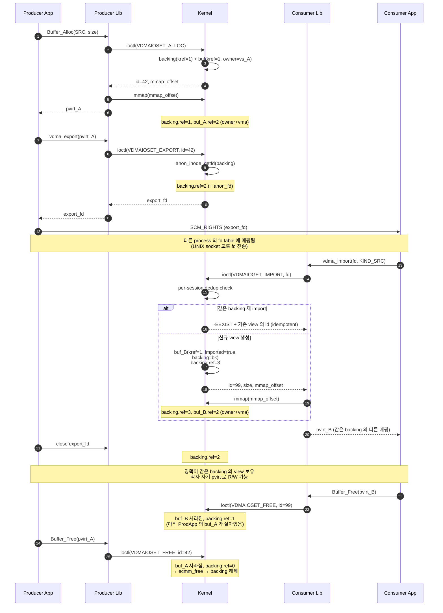

# 메모리 관리 — Cross-fd CMA Buffer 공유 설계 노트

> **상태: 구현 완료** (anon_inode 기반 EXPORT/IMPORT, ecmm 백엔드).
> 동작 검증: [userapp/example_vdma_share.c](../userapp/example_vdma_share.c).

동일한 `/dev/vdma_*` 디바이스에 여러 fd 가 열려있을 때 (멀티 프로세스),
드라이버가 만든 CMA 영역을 **fd 간에 공유** 하기 위한 설계 근거와 구현 매핑.

상세 자료구조는 [driver_structs.md](driver_structs.md), 전체 코드 가이드는
[CORE.md](CORE.md) 참고.

---

## 1. 좁혀진 범위 (시나리오 명확화)

### 1.1 CMA 메모리 자체는 device-global
- `ecmm_alloc()` 이 SoC 의 CMM (Eyenix Contiguous Memory Manager) 풀에서 buf 할당
- `dev->buf_xa` (XArray) 가 device 전역으로 `id ↔ buf*` 매핑 보유
- 메모리는 이미 device 안에 공유되어 있음 — 차단은 **접근권한 레이어**

### 1.2 풀어야 할 것은 접근권한
[enx-vdma-core.c](../enx-vdma-core.c) 의 모든 lookup 이 `buf->owner == vs` 검사를
거치는데, **owner 또는 attached** 로 확장해서 cross-fd 접근 허용.

### 1.3 시나리오별 처리

| 케이스 | 처리 방식 |
|--------|---------|
| 같은 프로세스, 멀티 스레드 | **fd 1개 공유** (lib 가 process-singleton). 별도 매커니즘 불필요. |
| 같은 프로세스, 멀티 모듈 | 위와 동일 (`vdma_font_open` refcount 매칭) |
| **다른 프로세스, 같은 device** | **EXPORT/IMPORT 로 anon_inode fd 전달** (이 문서의 주제) |

---

## 2. 채택된 설계 — Option B (anon_inode EXPORT/IMPORT)

### 2.1 핵심 아이디어 — backing + buf (per-view)

```
                    Producer fd (vs_A)               Consumer fd (vs_B)
                    ──────────────────               ──────────────────
alloc_src(SIZE)   → backing(kref=1) + buf_A(id=42, imported=false)
                    buf_A->owner = vs_A
                    buf_A->backing = bk
                    backing->cmm = ecmm_alloc(...)

EXPORT(42)        → anon_inode_getfd("[vdma_buf]")
                    backing kref = 2 (+ anon fd)
                    └── int fd ────────► SCM_RIGHTS ────► recv fd

                                                          IMPORT(fd) → buf_B(id=99, imported=true)
                                                          buf_B->owner = vs_B
                                                          buf_B->backing = bk (shared!)
                                                          backing kref = 3
                                                          (per-session dedup : 같은 backing
                                                           재 IMPORT 시 -EEXIST + 기존 view)

submit(src=buf_A.id)                                      submit(src=buf_B.id)
                       ↓ kernel side ↓
        ┌─────────────────────────────────────────────────┐
        │ struct enx_vdma_backing                         │
        │  cmm = ecmm region                              │
        │  kref = sum(buf 측 ref + anon_fd 측 ref)         │
        └───────────┬─────────────┬───────────────────────┘
                    │             │
            ┌───────▼──────┐ ┌────▼────────────┐
            │ buf_A (vs_A) │ │ buf_B (vs_B)    │
            │ owner = vs_A │ │ imported = true │
            │ ref = ...    │ │ ref = ...       │
            └──────────────┘ └─────────────────┘
```

### 2.2 ref 의 의미 — 두 단계 분리

**`buf->ref` (per-view)** 의 holder :

| Holder | 언제 +1 | 언제 -1 |
|--------|--------|--------|
| Owner | `vdma_do_alloc()` / `vdma_do_import()` | `vdma_do_free()` 또는 `release()` |
| In-flight job | SUBMIT 시 (`enx_vdma_buf_lookup_get`) | HW 완료 (`vdma_job_finish`) |
| Live VMA | `vdma_vm_open` (mmap) | `vdma_vm_close` (munmap / exit) |

→ 0 이 되면 `enx_vdma_buf_release()` : xa_erase + backing kref_put + kfree(buf)

**`backing->ref` (shared)** 의 holder :

| Holder | 언제 +1 | 언제 -1 |
|--------|--------|--------|
| 각 buf view | buf 생성 시 (alloc 또는 import) | buf release 에서 |
| Anon_inode fd | `vdma_do_export()` | fd close (어느 프로세스든) |

→ 0 이 되면 `enx_vdma_backing_release()` : `ecmm_free(cmm)` + `kfree(backing)`

### 2.3 Cross-process EXPORT/IMPORT 시퀀스



핵심 :
- **Backing 은 모든 view 가 free 되어야 회수** — 어느 쪽이 먼저 free 해도 backing 은 보존
- **Per-session dedup** — 같은 process 가 같은 backing 을 두 번 import 시 새 view 안 만들고 기존 것 재사용 (idempotent)
- **Cross-process 안전** — fd 가 SCM_RIGHTS 로 전달되므로 권한 검증 자동, anon_inode 가 backing 의 reference 보호

---

## 3. 구현 매핑 (UAPI / 커널 / 유저)

### 3.1 UAPI — [enx-vdma-uapi.h](../enx-vdma-uapi.h)

EXPORT/IMPORT 는 **함수와 무관한 공통 UAPI** 이므로 driver 별 헤더가 아니라
공통 헤더에 정의.

```c
struct vdma_export_args {
    u32  id;            /* IN  : local buf id to share */
    u32  __resv;
    s32  export_fd;     /* OUT : anon_inode fd, O_CLOEXEC */
    u32  __resv2;
};

struct vdma_import_args {
    s32  export_fd;     /* IN  : received via SCM_RIGHTS */
    u32  __resv;
    u32  id;            /* OUT : local id on this fd */
    u32  kind;          /* OUT : ENX_BUF_SRC | _DST */
    u32  size;          /* OUT : byte size */
    u64  mmap_offset;   /* OUT : pass to mmap() */
};

#define VDMAIOSET_EXPORT  _IOWR(ENX_VDMA_IOC_MAGIC, 0x04, struct vdma_export_args)
#define VDMAIOGET_IMPORT  _IOWR(ENX_VDMA_IOC_MAGIC, 0x05, struct vdma_import_args)
```

### 3.2 커널 — [enx-vdma-core.c](../enx-vdma-core.c) + [enx-vdma.h](../enx-vdma.h)

자료구조 정의 + 모든 helper 함수는 core 에 있음 (function-agnostic). driver 는
EXPORT/IMPORT 에 관여하지 않음 — core 가 `enx_vdma_ioctl_export/import` 를
`EXPORT_SYMBOL_GPL` 로 노출, driver 의 ioctl 디스패처가 그대로 호출.

**자료구조** (현재):
```c
struct enx_vdma_buf {
    u32 id;
    u32 kind;
    size_t size;
    struct eyenix_cmm_item *cmm;       /* ecmm backend */
    struct enx_vdma_dev *dev;
    struct enx_vdma_sess *owner;       /* NULL after FREE */
    struct list_head owner_node;       /* in vs->bufs */
    struct list_head attach_list;      /* importers */
    struct kref ref;                   /* +1 per holder */
};

struct enx_vdma_buf_attach {
    struct list_head buf_node;         /* in buf->attach_list */
    struct list_head file_node;        /* in vs->imports */
    struct enx_vdma_buf  *buf;
    struct enx_vdma_sess *session;
};

struct enx_vdma_sess {
    /* ... */
    struct list_head bufs;             /* own */
    struct list_head imports;          /* attaches */
    struct list_head jobs;
    struct list_head dev_node;         /* dev->sessions 등록용 */
};
```

**핵심 함수**:
- `enx_vdma_buf_accessible(buf, vs)` — owner OR `attach_list` 에 vs 가 있으면 true
- `enx_vdma_buf_lookup_get()` — 위 검사 + kref_get 까지 한 atomic 시퀀스 (xa_lock 안)
- `vdma_export_fops` — anon_inode 의 fops. `.release` 만 — fd close 시 kref_put
- `vdma_do_export()` — lookup_get → `anon_inode_getfd()` 로 fd 발급
- `vdma_do_import()` — `fget(fd)` → fops 검증 → attach 생성 + 양쪽 list 등록 + kref_get
- `vdma_buffer_free()` — owner 면 owner ref drop, attached 면 detach + ref drop
- `enx_vdma_release()` — imports 리스트 정리 → bufs 리스트 정리 (순서 중요)

### 3.3 라이브러리 — [userapp/libvdma_font.c](../userapp/libvdma_font.c) / [userapp/libvdma_font.h](../userapp/libvdma_font.h)

```c
int         vdma_font_export(vdma_addr_t addr, int *export_fd_out);
vdma_addr_t vdma_font_import(int export_fd,
                             size_t *size_out, uint32_t *kind_out);
```

사용자는 `vdma_addr_t` (= `void *` mmap 가상주소) 만 다룸 — 커널 id 는 라이브러리
가 숨김.

- `export`: `find_and_acquire(addr, 0)` 으로 내부 buf 찾고 transient ref 보유,
  ioctl 호출. anon_inode fd 를 사용자에게 그대로 반환 (close 책임은 사용자).
- `import`: lib 내부 fd 로 IMPORT ioctl → `mmap()` 으로 importer 측 vir_addr 생성
  → 내부 buf 등록 → vir_addr 반환. `size_out`/`kind_out` 으로 메타 출력.

### 3.4 사용자 데모 — [userapp/example_vdma_share.c](../userapp/example_vdma_share.c)

`fork()` + `socketpair(AF_UNIX)` + SCM_RIGHTS 로 부모/자식 간 cross-fd 공유
검증. 부모가 채운 패턴을 자식이 읽고, 자식이 쓴 marker 를 부모가 읽어서 **같은
ecmm 영역임을 양방향으로 확인**.

---

## 4. 라이프사이클 시나리오 (검증된 동작)

| 상황 | 결과 |
|------|------|
| Producer `vdma_font_free(buf)` 호출 (consumer 가 import 중) | owner ref drop. attach ref / anon_fd ref 가 살아있어 buf 유지. consumer 가 free 할 때 진짜 회수 |
| Consumer `vdma_font_free(shared)` 호출 (producer 가 owner) | attach ref drop. owner ref 살아있으면 buf 유지 |
| Producer 프로세스 SIGKILL (consumer 살아있음) | producer 의 `release()` 가 owner ref drop. attach ref 살아있으면 buf 유지 — consumer 영향 없음 |
| Consumer 프로세스 SIGKILL (producer 살아있음) | consumer 의 `release()` 가 attach detach. producer 영향 없음 |
| 양쪽 모두 종료 | 모든 ref drop → ecmm 회수 |
| 같은 export_fd 를 두 번 IMPORT (한 fd 에서) | 두 번째는 `-EEXIST` (의도된 보호) |
| Producer 가 free 한 buf 의 anon_fd 를 importer 가 받음 | anon_fd ref 가 살아있으면 IMPORT 성공 |

---

## 5. Per-fd ID 매핑 정책

> 결정: **importer 는 producer 와 동일한 global id 를 받음**.

근거:
- XArray (`dev->buf_xa`) 는 device-global 로 id 발급 → 충돌 불가
- importer 의 ID 도 producer 의 ID = global ID
- mmap offset 도 동일 (`id << PAGE_SHIFT`)
- 각 fd 의 lookup 은 `enx_vdma_buf_accessible()` 로 분기

장점: 별도 per-fd id namespace 불필요 — XArray 한 곳만 봄.
단점: 디버깅 시 "id 42 가 어느 fd 의 것인가" 가 모호 → `attach_list` 순회 또는
debugfs `bufs / sessions` 로 확인.

사용자에게 노출되는 식별자는 `vdma_addr_t` (mmap vir_addr). 같은 buf 라도
producer 와 consumer 의 vir_addr 은 **각자 자기 프로세스 주소공간의 매핑** 이라
다른 값. 내부적으로는 같은 global id 를 가리키지만 사용자는 신경 쓸 필요 없음.

---

## 6. 다른 옵션이 거부된 이유 (간략)

| 옵션 | 거부 이유 |
|------|---------|
| **A. Publish/Attach by id** | id 추측 가능성 → key/ACL 직접 만들어야 함. fd-as-capability 의 자동 보안 이점 상실 |
| **B. anon_inode EXPORT/IMPORT** | ✅ **선택** — fd-as-capability, 라이프사이클 자동, ~200 LOC |
| **C. dma-buf** | 좁힌 범위 (VDMA 내부 전용) 에 과도. `dma_buf_ops` 5~6 개 구현은 ~400 LOC. 외부 드라이버 연동 (V4L2/DRM) 안 할 거면 표준성 이득 작음 |
| **D. 전역 풀** (소유권 제거) | 격리 모델 자체가 사라짐. 죽은 프로세스 자동 회수 못 함. 보안 검토 통과 어려움 |

`anon_inode + SCM_RIGHTS` 패턴은 mainline 의 표준 idiom (eventfd, memfd, sync_file
등도 동일 매커니즘). 자세한 비교는 라운드별 토론 노트 참고.

---

## 7. 알려진 한계

### 7.1 `copy_to_user` 실패 시 fd 누수
`anon_inode_getfd()` 가 이미 fd 를 install 한 후 copy_to_user 가 실패하면 사용자는
fd 번호를 받지 못하지만 커널 fd table 에는 남음. 사용자 프로세스 종료 시 회수
(커널 측 leak 아님). 100% race-free 를 원하면 분리 패턴:
```c
get_unused_fd_flags() → anon_inode_getfile() → copy_to_user() → fd_install()
```

### 7.2 같은 fd 가 같은 buf 를 두 번 import 차단
`-EEXIST` 반환. 두 번 받으면 두 번 free 해야 하는 라이프사이클 혼란 방지.

### 7.3 kind 변환 불가
Producer 가 SRC 로 만든 buf 를 consumer 가 DST 로 쓸 수 없음. IMPORT 가 원본 kind
를 그대로 반환.

### 7.4 보안 — fd 출처 검증
IMPORT 가 `f->f_op == &vdma_export_fops` 검사로 우리 anon_inode 만 받음.
다른 종류 fd 는 `-EINVAL`. 같은 family 의 다른 device 도 거부 (`buf->dev != dev`
검사).

### 7.5 cross-device 공유 불가
인스턴스 A (예: vdma_font) 에서 만든 buf 를 인스턴스 B (예: vdma_scaler) 로
import 할 수 없음 (커널의 `buf->dev != dev` 검사). 디바이스 단위로만 공유.

---

## 8. debugfs 로 공유 상태 보기

`/sys/kernel/debug/enx_vdma/<node_name>/` 에서:

```sh
$ cat .../bufs
id      kind  size       refs  owner_pid
1       SRC   65536      3     8421       ← refs=3 → owner(1) + export_fd(1) + attach(1)
```

`refs` 값으로 holder 가 몇 개 있는지 즉시 확인. `owner_pid` 가 -1 이면 owner 가
free 했지만 다른 ref 로 살아있는 orphan buf.

`sessions` 파일로 누가 import 했는지 추정 가능:
```sh
$ cat .../sessions
pid    bufs  imports  jobs  bytes_owned
8421   1     0        0     65536      ← producer (1 owned buf)
8422   0     1        0     0          ← consumer (1 imported)
```

---

## 9. 추후 확장 시나리오

| 항목 | 무엇이 필요한가 |
|------|---------------|
| **외부 dma-buf import** (V4L2 → VDMA) | 별도 ioctl 또는 IMPORT 확장. `dma_buf_attach` 흐름. ~200 LOC |
| **VDMA → 외부 dma-buf export** (VDMA → DRM) | `dma_buf_ops` 구현. ~300 LOC. 현재 anon_fd 와는 별도 ioctl 권장 |
| **cross-device 공유** (font ↔ scaler) | 현재 차단. 같은 SoC family 안에서 허용하려면 `buf->dev != dev` 검사 완화 + ref accounting 검토 |
| **import 시 mmap 자동화 옵션** | 현재 lib 이 자동 mmap. submit 전용 사용 케이스에서 mmap skip 가능 |
| **kind 변환 import** | flag 추가해 SRC↔DST 허용 (HW capability 확인 후) |
| **ASYNC SUBMIT 의 buf ref 관리** | 현재 SYNC pointer reuse 정책 — ASYNC 케이스 도입 시 attach lifetime 재검토 |

---

## 10. 검증된 동작 확인

- 빌드 통과 (RISC-V cross): `enx_vdma.ko`, `font-drv/enx_vdma-font.ko`
- userapp 빌드 통과 (호스트 x86_64): `example_vdma_font`, `example_vdma_share`
- `example_vdma_share` 가 fork + SCM_RIGHTS + 패턴 검증 + marker 양방향 확인까지
  end-to-end 흐름 따라감
- 기존 `example_vdma_font` 호환 유지

---

## 11. 관련 파일

- [enx-vdma-uapi.h](../enx-vdma-uapi.h) — 공통 UAPI (EXPORT/IMPORT struct, ioctl 번호)
- [enx-vdma.h](../enx-vdma.h) — 커널 내부 헤더 (`enx_vdma_buf`, `enx_vdma_buf_attach` 등)
- [enx-vdma-core.c](../enx-vdma-core.c) — `vdma_do_export`, `vdma_do_import`, anon_inode fops, attach_list
- [font-drv/en683-font.c](../font-drv/en683-font.c) — driver 의 ioctl 디스패처가 core EXPORT/IMPORT helper 호출
- [userapp/libvdma_font.h](../userapp/libvdma_font.h) — `vdma_font_export` / `vdma_font_import` 선언
- [userapp/libvdma_font.c](../userapp/libvdma_font.c) — 라이브러리 측 구현
- [userapp/example_vdma_share.c](../userapp/example_vdma_share.c) — 동작 데모 (fork + socketpair)
- [README.md](README.md) §5.3 — 사용자 가이드
- [CORE.md](CORE.md) §7 — 커널 측 EXPORT/IMPORT 설계
- [driver_structs.md](driver_structs.md) — 자료구조 다이어그램

---

## 12. 한 줄 요약

> **CMA 메모리는 이미 device-global 이고, fd 간 접근권한만 anon_inode fd 를
> capability 로 전달하여 풀었다. dma-buf 도입 없이, 200 LOC 규모로 cross-fd
> 공유와 자동 라이프사이클 추적이 완성됐다. 백엔드는 SoC 의 ecmm 사용.**
